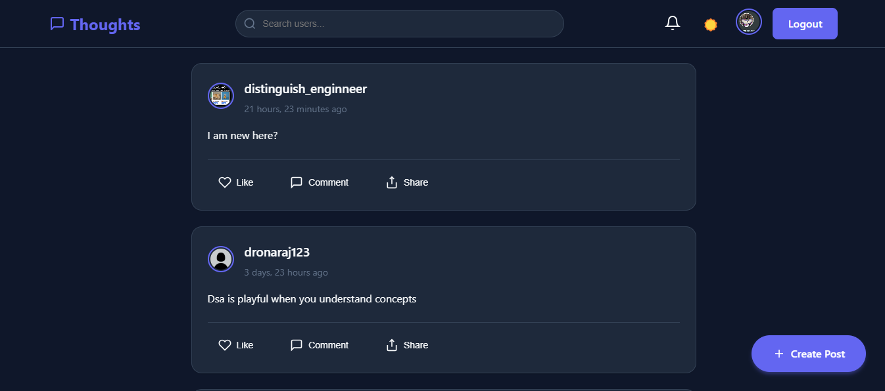

---

# Social Media - Thoughts 📱💬

Welcome to **Thoughts** — a simple yet interesting social media platform built with **Django**, **Python**, **HTML**, **CSS**, and **JavaScript**. This project allows users to share their thoughts, interact with posts through comments, and more exciting features are on the way!

---

## 🚀 Project Overview
- **Purpose:** A social platform for users to share and interact with each other's thoughts.
- **Current Features:**
  - User authentication
  - Post creation
  - Commenting system
  - Notification System
- **Upcoming Features:**
  - Real-time chat
  - Video call functionality

This project is currently under active development, and contributions are more than welcome!

---

## 🛠️ Setup Instructions

### 1. Clone the Repository
```bash
 git clone https://github.com/your-username/Thoughts-A-projects-using-django..git
 cd core
```

### 2. Create and Activate a Virtual Environment
```bash
 python -m venv myenv
 source myenv/Scripts/Activate  # For Windows
 source myenv/bin/activate      # For MacOS/Linux
```

### 3. Install Dependencies
```bash
 pip install -r requirements.txt
```

### 4. Run the Development Server
```bash
 python manage.py runserver
```

Visit `http://127.0.0.1:8000/` in your browser to view the app.

---

## 🤝 Contribution Guidelines
We welcome contributions from everyone! Here's how you can help:
1. Fork the repository.
2. Create a new branch.
3. Make your changes.
4. Submit a pull request.

Feel free to discuss ideas, report bugs, or suggest features in the **Issues** section.

---

## 📧 Contact
If you're interested in contributing or have questions, feel free to reach out:
- **Email:** dronarajgyawali@gmail.com
- **GitHub:** [Your GitHub Profile](https://github.com/drona-gyawali)

---

⭐ *If you like this project, don't forget to give it a star!* ⭐

